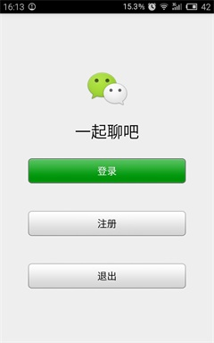
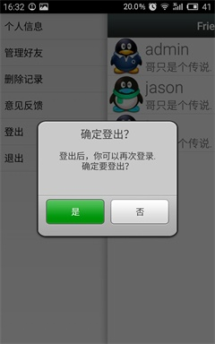
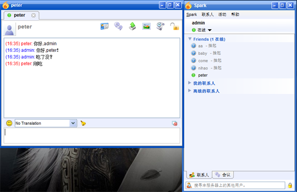

# LetsChat -  基于XMPP协议聊天客户端

程序可以让两个Android手机用户相互发送消息（类似于微信）.也可以给windows平台下的客户端发送消息。

## 已完成的功能有

 > * 注册
 > * 登录
 > * 修改密码
 > * 添加删除好友
 > * 聊天记录保存与恢复
 
## TODO
> * 添加群功能
> * 添加LBS
> * UI 优化
> * 聊天记录查找与恢复优化（增加索引）

## Attention
> * 程序在eclipse下测试成功
> * 想要登陆需要安装openfire服务器
> * 源代码里面有个Connect类，就是用来管理和服务器连接的，需要指定服务器地址才能成功登陆
> * 如果打开工程出现乱码，请用utf-8编码方式打开
 
## 效果图

